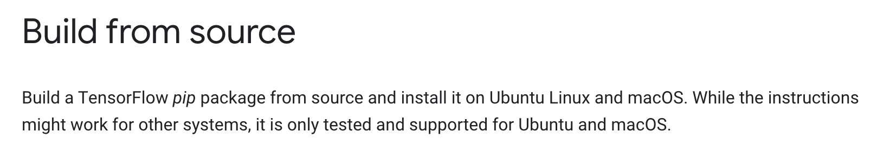
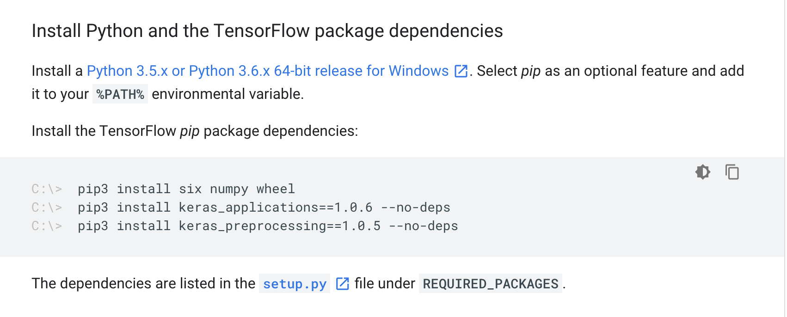
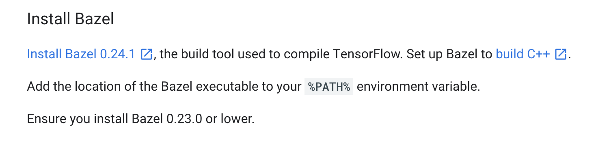
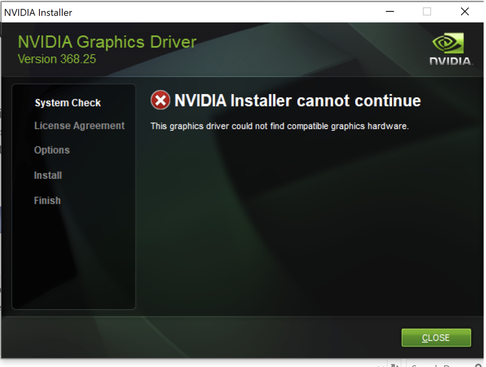
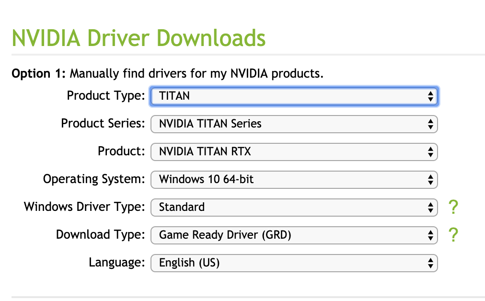
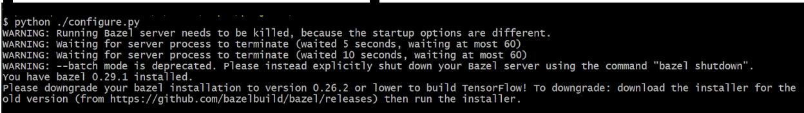

According to the Tensorflow website as of 10/12/2019, this configuration is not tested and is not supported. However, I was able to build tensorflow on Windows using Bazel with GPU support and I will detail my endeavor in what I hope is not too excruciating detail below. 

### A little background. 
We do machine learning stuff where I work. Normally we do machine learning stuff with tensorflow and the way we usually do this is we will build and train the neural net using Python.

Then, we want to convert this neural net into a product consumable by users, so we need to put it into a format accessible to the average person. Most people do not have Python installed, and most people do not use Linux as their operating system, but this is teh environment that seems to work best with Tensorflow. 

So what happens next is pretty much that we start converting all the Python code to C++, and we have to build an application to load the model on Windows, and another one that will build the model on the Mac. 

### First failed Attempt:
Since we have to build for both Mac and Windows, an easy thing to do in this situaiton is to use some cross platform framework like Qt so that you only have to write your code once. 

We tried getting some prebuild dlls and dylibs for tensorflow 1.14 and linking them into our project. We kept getting compiler errors about missing headers and unresolved external symbols no matter what we tried, so we determined that we might need more control, and decided to build Tensorflow ourselves. If you build the code yourself, you can find the exact line of code causing the missing header error or unresolved external symbol error and get what info you need to fix it.

### Building the Tensorflow Source code on Windows with GPU support

1. Before installing Bazel, make sure you can actually compile Tensorflow on your Windows machine. To compile something successfully you need the right hardware, the right compiler and so on. I find that most of the time the setup is the most specific and difficult part of software, not the actual code. So we're going to make sure your computer is ready for the task.  Read ``https://www.tensorflow.org/install/gpu#windows_setup`` to see the prereqs. You need to make sure you have a compatible graphics card.

The first thing you're going to see on that page is this: 

It's talking about Pip and Python a lot I suppose because most people end up building that instead of C++. This made me think I was in the wrong place at first, but you need to read through this to understand if your machine will work for the job so don't run away. 

The blue part with the star links to the prebuilt binaries. This was what we tried first and is usually the easiest way to go about using third party libraries in our C++ code. The reason it did not work for us I will explain in more detail later, but basically those libraries are not built with all their symbols exposed due to limitations on the number of symbols that can be loaded by the C++ linker. That is why we had to build from source, in your case you may be here for the same reason or others. 

The next thing you will see is this: 

You can safely ignore this part because you are not here to build tensorflow in Python, you are here to build it in C++ on Windows, but don't leave, you will need other stuff in this article.

The next thing you will see is this:

It is tempting to go in order and just click that link and go ahead and install Bazel, but remember what you are here to do, you need to build Tensorflow with GPU support, so, actually, keep scrolling down, 
Click the first link, it's going to take you to ``https://docs.bazel.build/versions/master/install-windows.html`` on the Bazel Website. 

According to the article you need: 

For example I checked my device manager under display adaptors to see what graphics card I have: 

You need to install the NVidia graphics driver for your card. You can type the name of your graphics card plus "Nvidia grpahics card driver to find the download page for your card."

You need to make sure you are downloading the latest version, in your search you may find an older version, and if you are lucky, when you run and install, you may see an error like this if your driver is too old:

But you might not be so lucky and have to find out later. 

The page for NVidia Graphics card drivers is ``https://www.nvidia.com/Download/index.aspx``

And you're going to find your graphics card using this thing:

If you don't see your graphics card in there keep looking,you are possibly looking under the wrong category. If it is an NVidia graphics card and it exists, it will be in there somewhere. If you go throiugh this form you are guaranteed to get the latest version. If you google and just find some link, there is a possibility you will download an older version, so make sure. 

 Install Bazel. I was hesitant to start using Bazel because I saw many examples using CMake, and because it was intimidating at first. However, I will say that the Bazel documentation is very good and the command line tools and syntax from Bazel are very well made, so there is no need to be scared of trying the new framework. 

The step to install Bazel are very well documented, so I will not include them in this document. You can follow them here: ``https://docs.bazel.build/versions/master/install-windows.html``
Note: I Just downloaded the bazel exe file from Github. I built tensorflow from source, but I did not need to build Bazel from source. 

Fortunately, Bazel is pretty mature, if you have the wrong version of Bazel, it will warn you like this:
 

